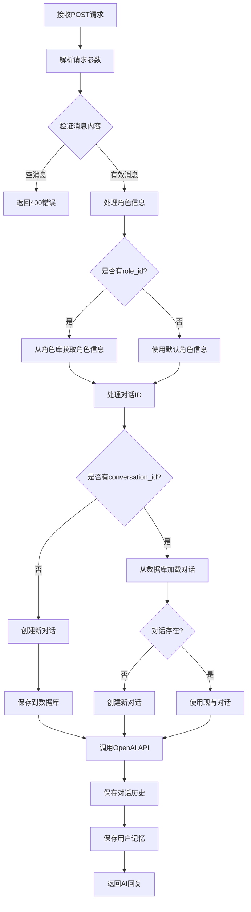

# 🧠 AI角色扮演平台后端处理逻辑分析

## 📋 整体架构

后端采用 **Flask + MongoDB** 架构，实现了完整的AI角色扮演对话系统，包含记忆功能、语音处理、角色管理等核心功能。

## 🔄 核心处理流程

### 1. 聊天对话处理流程 (`/api/chat`)



### 2. 详细处理步骤

#### 步骤1: 请求接收与验证
```python
# 接收POST请求
data = request.get_json()
user_message = data.get('message', '')
character_name = data.get('character_name', '小助手')
character_description = data.get('character_description', '...')
role_id = data.get('role_id', '')
conversation_id = data.get('conversation_id', '')
user_id = data.get('user_id', str(uuid.uuid4()))

# 验证消息内容
if not user_message:
    return jsonify({'success': False, 'error': '消息不能为空'}), 400
```

#### 步骤2: 角色信息处理
```python
# 如果提供了role_id，从角色库获取详细信息
if role_id:
    role_info = get_role_by_id(role_id)
    if role_info:
        character_name = role_info['name']
        character_description = role_info['description']
```

#### 步骤3: 对话管理
```python
# 创建新对话或加载现有对话
if not conversation_id:
    conversation_id = str(uuid.uuid4())
    conversation_data = {
        'conversation_id': conversation_id,
        'user_id': user_id,
        'character_name': character_name,
        'character_description': character_description,
        'messages': [],
        'created_at': datetime.now().isoformat()
    }
    conversations[conversation_id] = conversation_data
    if db:
        db.save_conversation(conversation_data)
```

#### 步骤4: OpenAI API调用
```python
def call_openai_api(user_message, character_name, character_description, conversation_id):
    # 1. 加载用户记忆和历史对话
    memory_data = load_user_memory_for_conversation(user_id, character_name)
    user_memory = memory_data.get('user_memory', {})
    recent_conversations = memory_data.get('recent_conversations', [])
    
    # 2. 构建增强的系统提示词
    system_prompt = f"""你是{character_name}，{character_description}
    
请严格按照以下要求进行角色扮演：
1. 完全沉浸在{character_name}的角色中，用第一人称说话
2. 保持角色的性格特点和说话风格
3. 回复要生动有趣，符合角色设定
4. 回复长度控制在100-300字之间
5. 使用中文回复"""

    # 3. 添加用户记忆信息
    if user_memory:
        memory_info = []
        if user_memory.get('total_messages', 0) > 0:
            memory_info.append(f"你与这个用户已经进行了{user_memory['total_messages']}次对话")
        
        if user_memory.get('user_preferences', {}).get('likes'):
            memory_info.append(f"用户喜欢：{', '.join(user_memory['user_preferences']['likes'])}")
        
        if memory_info:
            system_prompt += f"\n\n关于这个用户的记忆：\n" + "\n".join(memory_info)
    
    # 4. 构建消息列表
    messages = [{"role": "system", "content": system_prompt}]
    
    # 5. 添加对话历史
    if conversation_id in conversations and 'messages' in conversations[conversation_id]:
        recent_messages = conversations[conversation_id]['messages'][-20:]
        for msg in recent_messages:
            messages.append({
                "role": msg['role'],
                "content": msg['content']
            })
    
    # 6. 添加当前用户消息
    messages.append({"role": "user", "content": user_message})
    
    # 7. 调用OpenAI API
    payload = {
        "model": OPENAI_MODEL,
        "messages": messages,
        "max_tokens": 500,
        "temperature": 0.8,
        "top_p": 0.9,
        "frequency_penalty": 0.1,
        "presence_penalty": 0.1
    }
    
    response = requests.post(
        f'{OPENAI_API_URL}/chat/completions',
        json=payload,
        headers=headers,
        timeout=30
    )
```

#### 步骤5: 对话历史保存
```python
# 保存用户消息
conversations[conversation_id]['messages'].append({
    'role': 'user',
    'content': user_message,
    'timestamp': datetime.now().isoformat()
})

# 保存AI回复
conversations[conversation_id]['messages'].append({
    'role': 'assistant',
    'content': ai_response,
    'timestamp': datetime.now().isoformat()
})

# 保存到数据库
if db:
    db.save_conversation(conversations[conversation_id])
```

#### 步骤6: 用户记忆处理
```python
def save_user_memory_from_conversation(user_id, character_name, user_message, ai_response):
    # 获取现有记忆
    existing_memory = db.get_user_memory(user_id, character_name) or {}
    
    # 构建记忆更新
    memory_updates = {
        'last_conversation_time': datetime.now().isoformat(),
        'total_messages': existing_memory.get('total_messages', 0) + 1,
        'user_preferences': existing_memory.get('user_preferences', {}),
        'conversation_topics': existing_memory.get('conversation_topics', [])
    }
    
    # 提取用户偏好
    if '喜欢' in user_message or '不喜欢' in user_message:
        if '喜欢' in user_message:
            memory_updates['user_preferences']['likes'] = memory_updates['user_preferences'].get('likes', [])
        if '不喜欢' in user_message:
            memory_updates['user_preferences']['dislikes'] = memory_updates['user_preferences'].get('dislikes', [])
    
    # 保存记忆
    db.save_user_memory(user_id, character_name, memory_updates)
```

## 🗄️ 数据存储架构

### 1. 内存存储 (conversations)
```python
conversations = {
    "conversation_id": {
        "conversation_id": "uuid",
        "user_id": "user_id",
        "character_name": "角色名称",
        "character_description": "角色描述",
        "messages": [
            {
                "role": "user|assistant",
                "content": "消息内容",
                "timestamp": "2025-09-23T20:37:42"
            }
        ],
        "created_at": "2025-09-23T20:37:42"
    }
}
```

### 2. MongoDB存储结构

#### conversations集合
```json
{
    "_id": "ObjectId",
    "conversation_id": "uuid",
    "user_id": "user_id",
    "character_name": "角色名称",
    "character_description": "角色描述",
    "messages": [
        {
            "role": "user|assistant",
            "content": "消息内容",
            "timestamp": "2025-09-23T20:37:42"
        }
    ],
    "created_at": "2025-09-23T20:37:42",
    "updated_at": "2025-09-23T20:37:42"
}
```

#### user_memories集合
```json
{
    "_id": "ObjectId",
    "user_id": "user_id",
    "character_name": "角色名称",
    "memory_data": {
        "last_conversation_time": "2025-09-23T20:37:42",
        "total_messages": 5,
        "user_preferences": {
            "likes": ["魔法", "冒险", "火系魔法"],
            "dislikes": []
        },
        "conversation_topics": ["魔法学习", "冒险故事"]
    },
    "created_at": "2025-09-23T20:37:42",
    "updated_at": "2025-09-23T20:37:42"
}
```

## 🎯 核心功能模块

### 1. 角色管理系统
- **角色库**: 预定义9个角色，包含ID、名称、描述、图片、分类、标签、性格
- **角色搜索**: 支持按名称、描述、标签、分类搜索
- **角色信息**: 提供完整的角色元数据

### 2. 对话管理系统
- **对话创建**: 自动生成UUID作为对话ID
- **对话持久化**: 同时保存到内存和MongoDB
- **对话历史**: 支持查询特定角色的对话历史
- **对话删除**: 支持删除指定对话

### 3. 记忆系统
- **自动记忆提取**: 从对话中自动提取用户偏好
- **记忆持久化**: 用户记忆永久保存到MongoDB
- **记忆加载**: 新对话时自动加载历史记忆
- **记忆API**: 提供完整的记忆管理API

### 4. 语音处理系统
- **语音转文本**: 集成OpenAI Whisper API
- **文本转语音**: 集成OpenAI TTS API
- **音频格式支持**: 支持多种音频格式

## 🔧 技术实现细节

### 1. 错误处理
```python
try:
    # 主要逻辑
    pass
except requests.exceptions.Timeout:
    error_msg = '请求超时，请稍后重试'
    logger.error(error_msg)
    raise Exception(error_msg)
except requests.exceptions.RequestException as e:
    error_msg = f'网络请求失败: {str(e)}'
    logger.error(error_msg)
    raise Exception(error_msg)
except Exception as e:
    error_msg = f'API调用错误: {str(e)}'
    logger.error(error_msg)
    raise Exception(error_msg)
```

### 2. 日志记录
```python
import logging
logging.basicConfig(level=logging.INFO)
logger = logging.getLogger(__name__)

# 记录关键操作
logger.info(f"收到请求 - 消息: {user_message[:50]}..., 角色: {character_name}")
logger.info(f"OpenAI API调用成功，回复: {ai_response[:50]}...")
logger.info(f"对话保存成功: {conversation_id}")
```

### 3. 配置管理
```python
from dotenv import load_dotenv
load_dotenv('config.env')

OPENAI_API_KEY = os.getenv('OPENAI_API_KEY', 'your-openai-api-key')
OPENAI_API_URL = os.getenv('OPENAI_API_URL', 'https://api.openai.com/v1')
OPENAI_MODEL = os.getenv('OPENAI_MODEL', 'gpt-3.5-turbo')
```

## 📊 性能优化

### 1. 数据库索引
```python
# 自动创建索引
def create_indexes():
    conversations_collection.create_index("conversation_id", unique=True)
    conversations_collection.create_index("user_id")
    conversations_collection.create_index("character_name")
    conversations_collection.create_index("created_at")
    
    user_memories_collection.create_index([("user_id", 1), ("character_name", 1)], unique=True)
    user_memories_collection.create_index("user_id")
```

### 2. 内存缓存
- 使用内存字典缓存活跃对话
- 减少数据库查询次数
- 提高响应速度

### 3. 对话历史限制
```python
# 只保留最近的10轮对话，避免token过多
recent_messages = conversations[conversation_id]['messages'][-20:]
```

## 🚀 API端点总览

### 核心功能
- `POST /api/chat` - 与AI角色对话
- `POST /api/voice/transcribe` - 语音转文本
- `POST /api/voice/synthesize` - 文本转语音

### 角色管理
- `GET /api/characters` - 获取角色列表
- `GET /api/characters/<id>` - 获取特定角色
- `GET /api/characters/search` - 搜索角色

### 对话管理
- `GET /api/conversations` - 获取对话列表
- `GET /api/conversations/character/<name>` - 获取特定角色对话历史
- `DELETE /api/conversations/<id>` - 删除对话

### 记忆管理
- `GET /api/memory/<user_id>` - 获取用户所有记忆
- `GET /api/memory/<user_id>/<character_name>` - 获取用户角色记忆
- `POST /api/memory/<user_id>/<character_name>` - 保存用户记忆

### 数据库管理
- `GET /api/database/stats` - 获取数据库统计信息
- `POST /api/database/cleanup` - 清理旧对话记录
- `GET /api/health` - 健康检查

## 🎯 关键特性

### 1. 智能记忆系统
- **自动提取**: 从对话中自动识别用户偏好
- **持久化存储**: 记忆数据永久保存
- **智能加载**: 新对话时自动加载相关记忆
- **个性化回复**: 基于记忆提供个性化回复

### 2. 角色扮演增强
- **角色一致性**: 严格保持角色设定
- **记忆融合**: 将用户记忆融入角色对话
- **上下文保持**: 维护对话上下文连贯性

### 3. 数据持久化
- **双重存储**: 内存+数据库双重保障
- **自动备份**: 所有对话自动保存到数据库
- **数据恢复**: 支持从数据库恢复对话历史

### 4. 扩展性设计
- **模块化架构**: 各功能模块独立
- **API驱动**: 完整的RESTful API
- **配置灵活**: 支持环境变量配置

## 📈 监控与日志

### 1. 健康检查
```python
@app.route('/api/health', methods=['GET'])
def health_check():
    return jsonify({
        'status': 'healthy',
        'message': 'AI角色扮演平台后端服务运行正常',
        'database_status': db_status,
        'database_stats': db_stats,
        'features': {
            'persistent_storage': bool(db),
            'user_memory': bool(db)
        }
    })
```

### 2. 统计信息
- 对话数量统计
- 用户记忆数量统计
- 角色交互统计
- 数据库连接状态

---

**总结**: 后端实现了完整的AI角色扮演对话系统，具备智能记忆、数据持久化、角色管理等核心功能，为用户提供个性化和连贯的对话体验。
